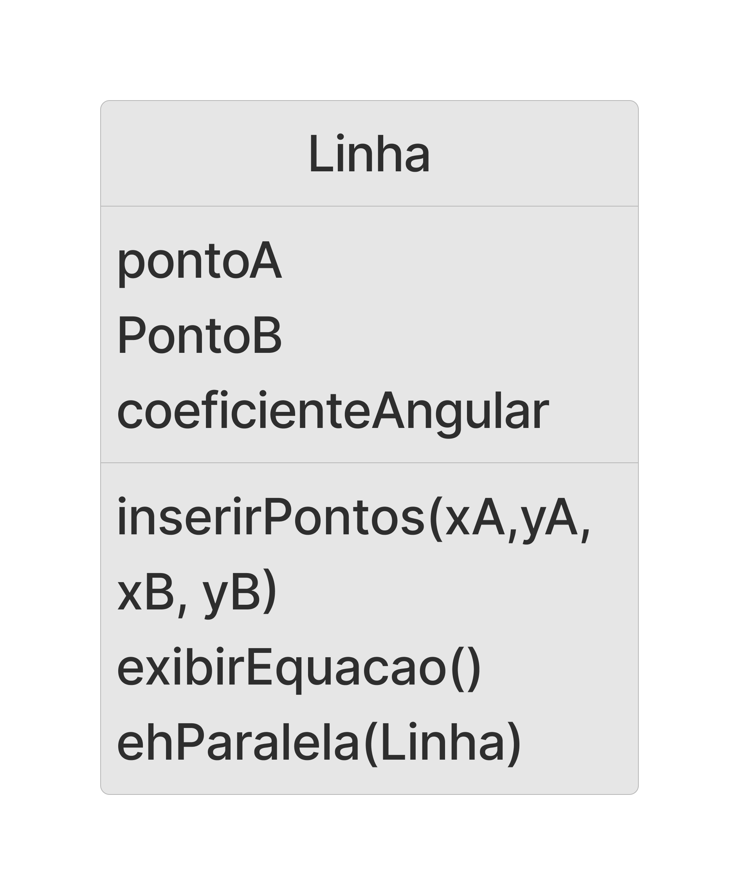

# Lista 03

## Questão 1


```
modelo ProdutoLampada
    float preco
    int potencia
    string material
    bool vendido = false
    bool funcionando = true

    metodo testar()
        retorna funcionando
    fim metodo

    metodo vender()
        se não vendido entao
            imprima "Produto vendido"
            vendido = true
        senão
            imprima "Esse produto já foi vendido"
        fim se
    fim metodo

fim modelo

```

## Questão 2


```
modeloLampada
    float nivelLuz

    metodo acendeTotal()
        nivelLuz = 1
    fim metodo

    metodo acendeMeiaLuz()
        nivelLuz = 0.5
    fim metodo

    metodo apaga()
        nivelLuz = 0
    fim metodo

    metodo mostraEstadoAtual()
        se nivelLuz == 0 então
            retorne "Apagado"
        senão se nivelLuz == 1 então
            retorne "Acesa Totalmente"
        senão então 
            retorne "Acessa Meia Luz"
        fim se
    fim metodo
fim modelo
```

## Questão 3


```
modelo LampadaLuzVariavel
    int nivelLuz

    metodo acende( int luz )
        se luz >= 0 e luz <= 100 então
            nivelLuz = luz
    fim metodo

    metodo apaga()
        nivelLuz = 0
    fim metodo

    metodo mostraEstadoAtual()
        imprime "A lâmpada está com nível de luz em " + nivelLuz + "%" 
    fim metodo
fim modelo
```

## Questão 4


```
modelo Lampada
    ... ( código anterior)

    metodo estaLigada()
        se estadoDaLampada == aceso então
            retorne verdadeiro
        senão 
            retorne falso
        fim se
    fim metodo
fim modelo
```

## Questão 5

```
modelo ContaBancariaSimplificada
    ... ( código anterior)
    metodo abreConta (nome, deposito, especial)
        nomeDoCorrentista = nome
        contaÉEspecial = especial
        se deposito < 0 então 
            saldo = 0
        senão
            saldo = deposito
        fim se
    fim metodo
    ... ( código posterior)
fim modelo  
```

## Questão 6

```
modelo ContaBancariaSimplificada
    ... ( código anterior)
    metodo abreConta (nome, deposito, especial)
        nomeDoCorrentista = nome
        contaÉEspecial = especial
        se deposito < 0 e especial == falso então 
            imprima "Você não pode abrir a conta com o saldo negativo"
        senão
            saldo = deposito
        fim se
    fim metodo
    ... ( código posterior)
fim modelo  
```

## Questão 7


```
modelo HoraAproximada
    int horas
    int minutos

    metodo horaValida(hr, min)
        valido = verdadeiro
        se hr < 0 ou hr > 24 ou min < 0 ou min > 60 então
            valido = falso
        fim se
        retorne valido
    fim metodo

    metodo inicializaHora (hr, min)
        se horaValida(hr, min) então
            horas = hr
            minutos = min
        senão
            horas = 0
            minutos = 0
        fim se
    fim metodo

    metodo exibe()
        imprime horas + " : " + minutos
    fim metodo
fim modelo  
```

## Questão 8


```
modelo HoraPrecisa
    int horas
    int minutos
    int centesimos

    metodo horaValida(hr, min, cent)
        valido = verdadeiro
        se hr < 0 ou hr > 24 ou min < 0 ou min > 60 ou cent < 0 ou cent > 100 então
            valido = falso
        fim se
        retorne valido
    fim metodo

    metodo inicializaHora (hr, min, cent)
        se horaValida(hr, min, cent) então
            horas = hr
            minutos = min
            centesimos = cent
        senão
            horas = 0
            minutos = 0
            centesimos = 0
        fim se
    fim metodo

    metodo exibe()
        imprime horas + " : " + minutos + " : " + centesimos
    fim metodo
fim modelo  
```

## Questão 9


```
modelo Livro
    string titulo
    string sinopse
    string autor
    int quantPaginas
    int numEdicao

    metodo setTitulo(valor)
        titulo = valor
    fim metodo

    metodo setSinopse(valor)
        sinopse = valor
    fim metodo

    metodo setAutor(valor)
        autor = valor
    fim metodo

    metodo setQuantPaginas(valor)
        se valor > 0 então
            quantPaginas = valor
    fim metodo

    metodo setNumEdicao(valor)
        se valor > 0 então 
            numEdicao = valor
    fim metodo

    metodo exibeInfo()
        imprima "Informações do livro " + titulo
        imprima "Autor: " + autor
        imprima "Sinopse: " + sinopse
        imprima "Quantidade de páginas: " + quantPaginas
        imprima "Edição nº: " + numEdicao
    fim metodo
fim modelo  
```

## Questão 10


```
modelo LivroDeLivraria
    ... (Além do que já existe na classe da questão 09)
    float preco
    bool vendido
    string prateleira

    metodo buscaLivro()
        imprima "O livro está na prateleira " + prateleira
    fim metodo

    metodo foiVendido()
        se vendido então
            retorne verdadeiro
        senão 
            retorne falso
        fim se
    fim metodo

    metodo vender()
        se não foiVendido() então
            vendido = verdadeiro
            imprima "Livro foi vendido agora"
        senão
            imprima = "Esse livro já foi vendido"
        fim se
    fim metodo
fim modelo  
```

## Questão 11


```
modelo LivroDeBiblioteca
    ... (Além do que já existe na classe da questão 09)
    bool especial
    bool emprestado
    string prateleira
    string pessoaEmprestimo

    metodo buscaLivro()
        imprima "O livro está na prateleira " + prateleira
    fim metodo

    metodo foiEmprestado()
        se emprestado então
            retorne verdadeiro
        senão 
            retorne falso
        fim se
    fim metodo

    metodo quemPegou()
        se foiEmprestado() então
            imprima "Livro foi emprestado para " + pessoaEmprestimo
        senão
            imprima = "Esse livro não foi emprestado"
        fim se
    fim metodo

    metodo emprestarPara(nome)
        se não foiEmprestado() então
            pessoaEmprestimo = nome
            emprestado = verdadeiro
        fim se
    fim metodo

    metodo devolver ()
        emprestado = falso
        pessoaEmprestimo = ""
    fim metodo
fim modelo  
```

> A lógica de vender um livro e emprestar um livro até são parecidas, mas no empréstimo o livro retorna, fazendo com que essa classe tenha o método emprestar e devolver. O livro até pode ser devolvido na compra, por insatisfação, mas é um caso especial, diferente da devolução em uma biblioteca

## Questão 12


> Para desenhar um gráfico seria necessário estabelecer os pontos através de uma função e criar ponto por ponto

## Questão 13



